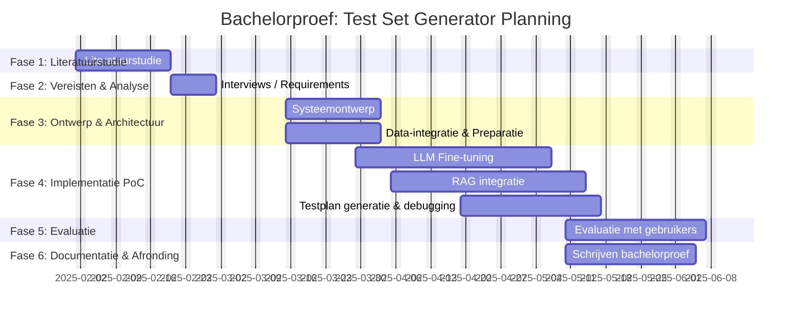

```mermaid
gantt
    title Bachelorproef: Test Set Generator Planning
    dateFormat  YYYY-MM-DD
    excludes    weekends
    section Fase 1: Literatuurstudie
    Literatuurstudie         :a1, 2025-02-01, 14d
    section Fase 2: Vereisten & Analyse
    Interviews / Requirements :a2, after a1, 7d
    section Fase 3: Ontwerp & Architectuur
    Systeemontwerp           :a3, 2025-03-15, 14d
    Data-integratie & Preparatie :a4, 2025-03-15, 14d
    section Fase 4: Implementatie PoC
    LLM Fine-tuning          :a5, 2025-03-29, 28d
    RAG integratie           :a6, 2025-04-05, 28d
    Testplan generatie & debugging :a7, 2025-04-19, 21d
    section Fase 5: Evaluatie
    Evaluatie met gebruikers :a8, 2025-05-10, 21d
    Section Fase 6: Documentatie & Afronding
    Schrijven bachelorproef  :a9, 2025-05-10, 19d
```